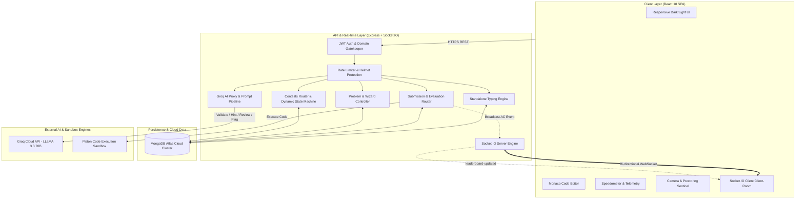
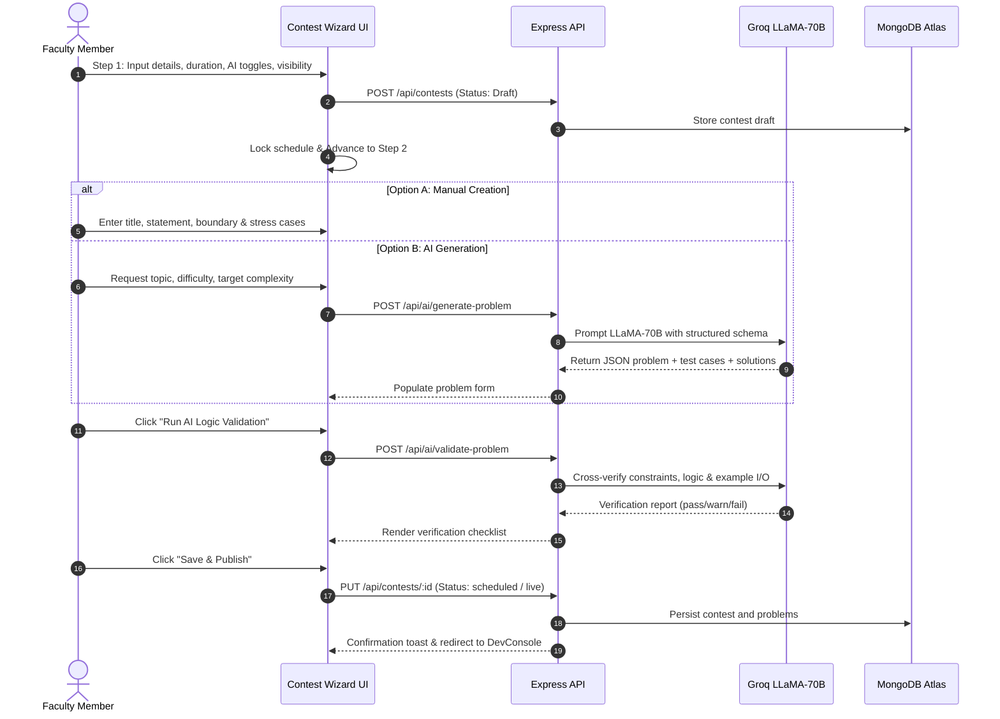
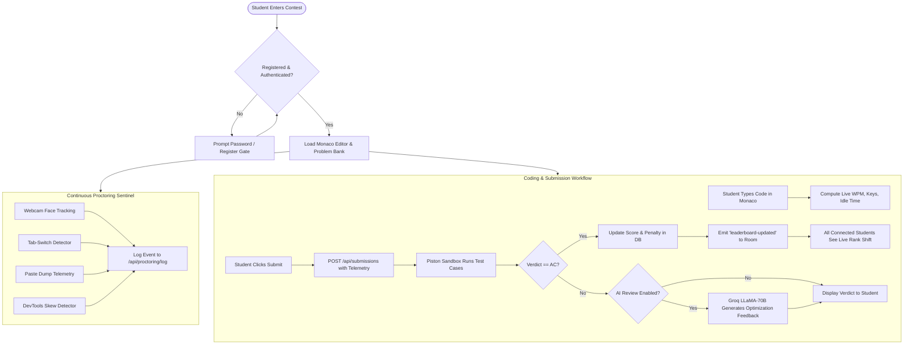
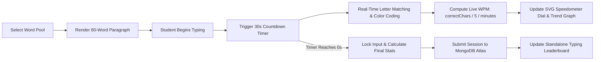

# ⚡ HackWithBug — Next-Gen AI-Powered Competitive Programming & Assessment Platform

[](https://reactjs.org/)
[](https://nodejs.org/)
[](https://www.mongodb.com/atlas)
[](https://groq.com/)
[](https://socket.io/)
[](https://microsoft.github.io/monaco-editor/)
[](LICENSE)

---

**HackWithBug** is an enterprise-ready, AI-orchestrated competitive programming platform engineered for universities, colleges, and hackathons. It integrates **real-time code execution**, **multi-modal browser proctoring**, **Groq LLaMA-3.3-70B AI mentoring and problem generation**, **instant Socket.IO leaderboard synchronization**, and a **standalone Monkeytype-style typing speed engine**.

---

## 📑 Table of Contents
1. [Key Highlights](#-key-highlights)
2. [System Architecture](#-system-architecture)
3. [Architecture & Workflow Flowcharts](#-architecture--workflow-flowcharts)
   - [1. End-to-End System Architecture](#1-end-to-end-system-architecture)
   - [2. Contest Lifecycle & Multi-Step Wizard Flow](#2-contest-lifecycle--multi-step-wizard-flow)
   - [3. Real-Time Arena, Proctoring & AI Evaluation Loop](#3-real-time-arena-proctoring--ai-evaluation-loop)
   - [4. Monkeytype-Style Standalone Typing Speed Engine](#4-monkeytype-style-standalone-typing-speed-engine)
4. [Deep-Dive Feature Breakdown](#-deep-dive-feature-breakdown)
5. [Tech Stack Matrix](#-tech-stack-matrix)
6. [Database Schema & Models](#-database-schema--models)
7. [REST API Documentation](#-rest-api-documentation)
8. [Installation & Setup Guide](#-installation--setup-guide)
9. [Default Test Accounts](#-default-test-accounts)
10. [Anti-Cheat & Proctoring Specifications](#-anti-cheat--proctoring-specifications)
11. [License & Acknowledgements](#-license--acknowledgements)

---

## 🌟 Key Highlights

- 🧙 **Multi-Step Faculty Contest Wizard**: Create public/private contests, lock schedules, auto-generate story-based DSA problems via LLaMA-3.3-70B, and run multi-point AI logic validations before publishing.
- 💻 **Monaco Code Editor Workspace**: VS Code-grade coding experience with custom font zooming, theme switching (`vs-dark` / `vs-light`), multi-language starter templates, and custom test input runners.
- 🛡️ **Zero-Extension Browser Proctoring**: Continuous video/face presence verification, tab-switch monitoring, fullscreen lock enforcement, DevTools timer skew detection, and copy/paste telemetry.
- ⚡ **Instant Real-Time Leaderboards**: Powered by WebSockets (Socket.IO). Broadcasts live score and penalty recalculations instantly across all connected participants upon every accepted verdict.
- 🤖 **Groq LLaMA-3.3-70B AI Suite**:
  - Automated hint generation and logic guidance without spoiling complete solutions.
  - Interactive AI coding chatbot scoped to problem statements.
  - Automated AI code reviews analyzing Time/Space complexity with optimization tips.
  - Plagiarism engine combining structural K-gram fingerprinting with semantic AI similarity reports.
- ⌨️ **Standalone Monkeytype-Style Speed Test**: Real-time 30-second word pool typing test with instant WPM speedometer, accuracy tracking, SVG trend charts, and global typing leaderboards.
- 💬 **Collaborative Community & Discussions**: Integrated Q&A discussion board with upvotes and faculty-accepted answer pins, plus an in-app notification center.
- 📊 **Codolio / LeetCode-Style Profiles**: Rating progression curves, daily coding streaks, and detailed verdict breakdowns.

---

## 🏛 System Architecture

The platform follows a decoupled, resilient client-server architecture:

```
┌─────────────────────────────────────────────────────────────────────────┐
│                           CLIENT TIER (React 18)                        │
│  Monaco Editor • Chart.js • Socket.IO Client • React Router • Hot Toast │
└────────────────────────────────────┬────────────────────────────────────┘
                                     │ HTTP REST / WebSocket (Socket.IO)
                                     ▼
┌─────────────────────────────────────────────────────────────────────────┐
│                      BACKEND SERVICES (Node.js / Express)               │
│  ├── JWT Authentication & Domain Filters (@paruluniversity.ac.in)      │
│  ├── Contest & Problem Management Engine                                │
│  ├── Real-Time Proctoring & Telemetry Aggregator                        │
│  ├── Socket.IO Broadcast Engine (Room: contest-{id})                   │
│  └── Anti-Plagiarism & K-Gram Hashing Pipeline                          │
└───────────────┬───────────────────────────────┬─────────────────────────┘
                │                               │
        Mongoose Queries               REST AI Completions / Execution
                ▼                               ▼
┌───────────────────────────────┐ ┌───────────────────────────────────────┐
│     DATABASE (MongoDB Atlas)  │ │          EXTERNAL ENGINES             │
│  • Users, Profiles, Streaks   │ │  • Groq LLaMA 3.3 70B (AI Mentor)     │
│  • Contests & Dynamic States  │ │  • Piston Sandbox Code Runner Engine  │
│  • Problems & Test Cases      │ └───────────────────────────────────────┘
│  • Submissions & Telemetry    │
│  • Discussions & Highscores   │
└───────────────────────────────┘
```

---

## 📊 Architecture & Workflow Flowcharts

### 1. End-to-End System Architecture



---

### 2. Contest Lifecycle & Multi-Step Wizard Flow



---

### 3. Real-Time Arena, Proctoring & AI Evaluation Loop



---

### 4. Monkeytype-Style Standalone Typing Speed Engine



---

## 🔍 Deep-Dive Feature Breakdown

### 1. 🧙 Multi-Step Contest Creation Wizard (`/dev/contest/:id?`)
- **Step 1: Configuration**: Sets contest name, description, banner URL, public/private access, duration, maximum marks, proctoring requirements, leaderboard visibility (Live, Frozen at $T - \text{mins}$, or Hidden), and fine-grained AI toggles (hints, chat, review, explanation).
- **Step 2: Dual Problem Builder**:
  - **Manual Creator**: Markdown statement editor, constraints, input/output format, sample cases, boundary cases, stress cases, and reference codes across 4 languages.
  - **AI Generator**: Prompts Groq LLaMA-3.3-70B with specific topics, target complexity ($O(N)$, $O(N \log N)$), and story styles to produce production-grade problem definitions.
  - **AI Verification Pipeline**: Validates edge cases, solution bounds, and logic consistency before saving.
- **Instant Contest Duplication**: Clone existing contests and all associated problems with a single click.

### 2. 💻 Monaco Contest Arena (`/contest/:id`)
- **Professional Editor**: Integrated `@monaco-editor/react` with VS Code keybindings, font-size zoom controls (`A+` / `A-`), and dark/light themes.
- **Dynamic Contest Status Handling**: Automatically transitions contests from `scheduled` to `live` and `ended` based on system time.
- **Custom Input Sandbox**: Execute code against custom stdin values prior to final submission.
- **Live Communication**: Integrated Contest Announcements feed and Problem Discussions Q&A tab.

### 3. 🛡️ Comprehensive Anti-Cheat & Proctoring Engine
- **Webcam Presence**: Real-time canvas-based facial detection logging face-absent events.
- **Tab & Window Focus**: Detects `visibilitychange` and window blur events, recording total tab switches and displaying warning toasts.
- **DevTools Detection**: Senses debugger delays and console inspection tricks.
- **Paste Dump Tracking**: Distinguishes between natural typing and sudden external paste dumps.
- **Plagiarism Detection**: 
  - Structural K-gram token hashing to find code similarities.
  - Groq LLaMA semantic analysis comparing variable renaming, control flow flattening, and code structure.

### 4. ⌨️ Standalone Typing Speed Module (`/typing`)
- **Monkeytype-Inspired Experience**: Clean, minimalist word pool interface focusing strictly on natural typing flow (not mixed with contest code).
- **Instant Speedometer & Trend Curve**: Real-time SVG gauge visualizing current WPM, average WPM, peak WPM, keystrokes, accuracy percentage, and backspaces.
- **Dedicated Highscores**: Standalone leaderboard tracking top typists across the university.

---

## 🛠 Tech Stack Matrix

| Layer | Technologies / Libraries |
|---|---|
| **Frontend** | React 18, React Router v7, Monaco Editor (`@monaco-editor/react`), Chart.js, React-ChartJS-2, React Hot Toast, Axios, Socket.IO Client |
| **Backend** | Node.js, Express.js, Socket.IO, JWT (JSON Web Tokens), Bcryptjs, Helmet, Morgan, Express-Rate-Limit |
| **Database** | MongoDB Atlas (Cloud Database), Mongoose ODM |
| **AI Intelligence** | Groq Cloud SDK (`llama-3.3-70b-versatile`) |
| **Execution Engine** | Piston Code Execution API (C++17, Python 3, Java 17, C, JavaScript) |
| **Styling** | Modern CSS Design System, Responsive Glassmorphism, CSS Custom Properties |

---

## 🗄 Database Schema & Models

```
├── User
│   ├── name, email, enrollment, password (bcrypt hashed), role ('student' | 'faculty')
│   ├── department, semester, rating, solved, rank, streak, avatar
│   └── bookmarks[], achievements[], dailyStreak, lastSolvedDate
│
├── Contest
│   ├── title, description, bannerUrl, contestType ('public' | 'private'), password
│   ├── startTime, endTime, duration, maxMarks, numProblems, status ('draft' | 'scheduled' | 'live' | 'ended')
│   ├── problems[] -> ref: Problem, createdBy -> ref: User, registeredUsers[] -> ref: User
│   ├── proctored, allowedLangs[], maxParticipants, leaderboardVisibility, freezeMinutes
│   └── aiEnabled, aiChat, aiHints, aiReview, aiExplain, announcements[]
│
├── Problem
│   ├── title, difficulty ('easy' | 'medium' | 'hard'), points, tags[], statement, constraints
│   ├── inputFormat, outputFormat, sampleInput, sampleOutput, explanation, editorial
│   ├── optimalAlgorithm, timeLimit, memoryLimit, referenceSolutions { cpp, java, python, js }
│   └── hiddenTestCases[], boundaryCases[], stressCases[]
│
├── Submission
│   ├── userId -> ref: User, problemId -> ref: Problem, contestId -> ref: Contest
│   ├── code, language, verdict ('AC' | 'WA' | 'TLE' | 'MLE' | 'CE' | 'RE'), time, memory
│   └── typingAnalytics { wpm, avgWpm, peakWpm, keystrokes, pasteCount, copyCount, idleTime, wpmHistory[] }
│
├── TypingPracticeSession
│   ├── userId -> ref: User, language, snippetName, avgWpm, peakWpm, accuracy
│   └── keystrokes, backspaces, duration, createdAt
│
├── ProctoringLog
│   ├── contestId, userId, tabSwitches, pasteEvents, fullscreenExits, events[]
│
├── Discussion & Answer
│   ├── contestId, problemId, userId, title, body, likes[], answers[] { userId, body, accepted }
│
├── Notification
│   ├── userId, type, title, message, read, link, createdAt
│
└── DailyChallenge
    ├── date (YYYY-MM-DD), problemId -> ref: Problem, solvers[] -> ref: User
```

---

## 🔌 REST API Documentation

### Authentication & Profiles
| Method | Endpoint | Description | Access |
|---|---|---|---|
| `POST` | `/api/auth/register` | Register new student/faculty account | Public |
| `POST` | `/api/auth/login` | Login and receive JWT bearer token | Public |
| `GET` | `/api/auth/me` | Fetch active authenticated user profile | Private |
| `GET` | `/api/profile/:enrollment` | Fetch public Codolio-style coding profile | Private |
| `PUT` | `/api/profile/me` | Update bio, social handles, and avatar | Private |

### Contests & Contest Wizard
| Method | Endpoint | Description | Access |
|---|---|---|---|
| `GET` | `/api/contests` | List all contests (with dynamic status update) | Private |
| `GET` | `/api/contests/:id` | Get contest details, problems, and registration state | Private |
| `POST` | `/api/contests` | Create new contest wizard draft | Faculty |
| `PUT` | `/api/contests/:id` | Update contest configuration / Publish | Faculty |
| `POST` | `/api/contests/:id/register` | Register student for public/private contest | Private |
| `POST` | `/api/contests/:id/duplicate` | Deep-clone contest and all its problems | Faculty |
| `PATCH` | `/api/contests/:id/ai-settings` | Toggle contest AI feature permissions | Faculty |
| `POST` | `/api/contests/:id/announce` | Broadcast an announcement to live contest | Faculty |
| `GET` | `/api/contests/:id/announcements`| List announcements for contest | Private |

### AI Suite (Groq LLaMA-3.3-70B)
| Method | Endpoint | Description | Access |
|---|---|---|---|
| `POST` | `/api/ai/generate-problem` | Auto-generate structured problem statement | Faculty |
| `POST` | `/api/ai/validate-problem` | Run AI logic verification on test cases & bounds | Faculty |
| `POST` | `/api/ai/hint` | Request contextual problem-solving hint | Private |
| `POST` | `/api/ai/chat` | AI coding chat assistant scoped to active problem | Private |
| `POST` | `/api/ai/feedback` | Post-submission automated AI code review | Private |
| `POST` | `/api/ai/plagiarism-analyze`| Semantic plagiarism comparison between submissions | Faculty |

### Submissions & Leaderboard
| Method | Endpoint | Description | Access |
|---|---|---|---|
| `POST` | `/api/submissions` | Submit solution, run judge, broadcast score via Socket.IO | Private |
| `GET` | `/api/submissions` | List submission history (filter by user/contest) | Private |
| `GET` | `/api/leaderboard` | Global university leaderboard | Private |
| `GET` | `/api/leaderboard/contest/:id` | Contest-specific leaderboard with penalty calculation | Private |

### Standalone Typing Speed Test
| Method | Endpoint | Description | Access |
|---|---|---|---|
| `POST` | `/api/typing-practice/sessions` | Log completed typing speed session | Private |
| `GET` | `/api/typing-practice/history` | Get user typing test attempt history | Private |
| `GET` | `/api/typing-practice/leaderboard`| Global standalone typing highscores | Public / Private |

---

## 🚀 Installation & Setup Guide

### Prerequisites
- [Node.js](https://nodejs.org/) (v18.x or higher)
- [npm](https://www.npmjs.com/) (v9.x or higher)
- [MongoDB Atlas](https://www.mongodb.com/atlas) cluster connection string
- [Groq Cloud](https://console.groq.com/) API Key (Free tier available)

---

### Step 1: Clone Repository
```bash
git clone https://github.com/prince-721/HackWithBug.git
cd HackWithBug/hackwithbug
```

### Step 2: Configure Environment Variables

Create `.env` in `server/`:
```env
PORT=5000
MONGODB_URI=mongodb+srv://<username>:<password>@cluster0.mongodb.net/hackwithbug?retryWrites=true&w=majority
JWT_SECRET=hackwithbug_super_secret_jwt_key_2025
GROQ_API_KEY=gsk_your_groq_api_key_here
ALLOWED_DOMAIN=paruluniversity.ac.in
```

### Step 3: Install Dependencies & Run

#### Terminal 1 — Backend Server
```bash
cd server
npm install
npm start
# Server boots on port 5000 with MongoDB Atlas & Socket.IO
```

#### Terminal 2 — React Client
```bash
cd client
npm install
npm start
# Frontend compiles and launches on http://localhost:3000
```

---

## 👥 Default Test Accounts

| Role | Enrollment / ID | Email Format | Password | Dashboard Features |
|---|---|---|---|---|
| **Student** | `21bce123` | `21bce123@paruluniversity.ac.in` | `password123` | Contest Arena, Practice Mode, Typing Speed Test, Leaderboards, Discussions |
| **Faculty** | `pm001` | `pm001@paruluniversity.ac.in` | `faculty123` | Multi-Step Contest Wizard, Problem Editor, Plagiarism Inspector, AI Validator |

*(Note: Clicking the demo account quick-fill buttons on the login screen automatically fills in test credentials).*

---

## 🛡 Anti-Cheat & Proctoring Specifications

| Detection Vector | Mechanism | Action Taken |
|---|---|---|
| **Tab / Window Switching** | `document.visibilitychange` + `window.onblur` | Increments tab-switch count, shows warning toast, records timestamp in `ProctoringLog`. |
| **Webcam Face Tracking** | HTML5 Canvas pixel analysis | Flags face absence, logs alert in proctoring timeline. |
| **Fullscreen Enforcement** | Fullscreen API exit event listener | Prompts immediate re-entry modal and records exit event. |
| **Clipboard / Paste Dump** | Paste event character-rate analysis | Dumps exceeding natural typing thresholds trigger paste violation logs. |
| **Code Similarity** | Winnowing K-gram hashing + Groq LLaMA Semantic AST comparison | Computes similarity percentage; flags submissions exceeding 65% for faculty review. |

---

## 📄 License & Acknowledgements

- **License**: Released under the [MIT License](LICENSE).
- **Inspirations**: LeetCode, Codeforces, Monkeytype, Codolio.
- Developed with ❤️ for competitive programmers and tech educators.
